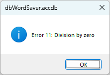
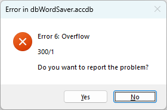
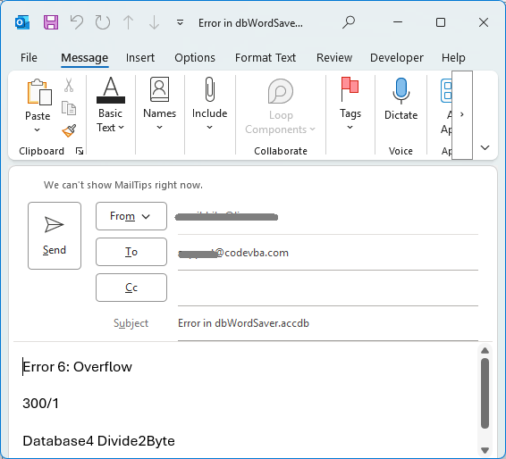

# VBA ErrorHandler - the HandleError function
This small repository contains an ErrorHandler module with a central HandleError function featuring user message dialog with optional Cancel, logging and reporting by email to the developer/adminstrator. <i>To use the ErrorHandler requires you to include [module MailToProxy](https://github.com/codevba-com/vba-mailtoproxy) in the VBA project.</i> 

Below is an example of using the HandleError function. The first known case (11) gives the user a standard informative message. The case Else apparently was not anticipated and the developer wants this situation to be reported to him by email.   

## Example use of the HandleError function

```vba
Function Divide2Byte(numerator As Integer, denominator As Integer) As Byte
    On Error GoTo HandleError
    Const cstrProcedure As String = "Divide2Byte"
    Divide2Byte = numerator / denominator
HandleExit:
    Exit Function
HandleError:
    Select Case Err.Number
    Case 11 'Division by zero
        HandleError Err, FeedbackType:=eftSimpleMessage
    Case Else 'unknown, for fixing we need more details!
        HandleError Err, FeedbackType:=eftReportableMessage, Procedure:=cstrProcedure, ExtraInfo:=numerator & "/" & denominator
    End Select
    Resume HandleExit
End Function
```
## HandleError function parameters
- Err As ErrObject: contains the error essential info - number, description and source. 
- FeedbackType As ErrorFeedbackType: allowed value are eftReportableMessage, eftSimpleMessage (the main choices), eftDefault and eftNone. 
- Module As String: use a module level constant.
- Procedure As String: use a procedure level constant.
- ExtraInfo As String: stuff this with infor that may be helpful to reproduce any error here.
- ErrLine As Long: if you use line numbers.
- If the user presses Cancel HandleError returns False, meaning 'don't continue'.
## Testing the HandleError function behaviour
In the Immediate window, the first test will give the message dialog with the simple informative message. 
The second test triggers an unanticipated error. The message dialog opens allowing the user to report this by email with all available info included.
```vba
?Divide2Byte(numerator:=2, denominator:=0)
?Divide2Byte(numerator:=300, denominator:=1)
```


## ErrorHandler module properties
The module properties allow you to set defaults to the way errors are handled
- ErrorFeedbackType: If FeedbackType is not specified in the function call, this value is used. Its default is eftReportableMessage
- ErrorLoggingType: possible values are elNone (the default), elImmediateWindow and elErrorLogFile 
- ErrorLogFile: full name of the text file to which errors are logged - if applicable (ErrorLoggingType). If not specified it will be written to ErrorLog.txt in the same folder a the Office document (or database) is in - easy to find.
- ErrorTitleSimple: the title to use with the message box. If not specified the name of the Office document is used.
- ErrorTitle: the title to use with the message box in case of a reportable error. If not specified the name of the Office document is used, preceded by 'Error in ' indicating the more serious status.
